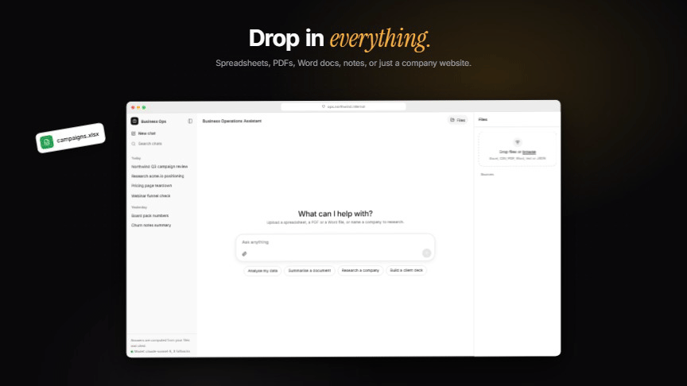
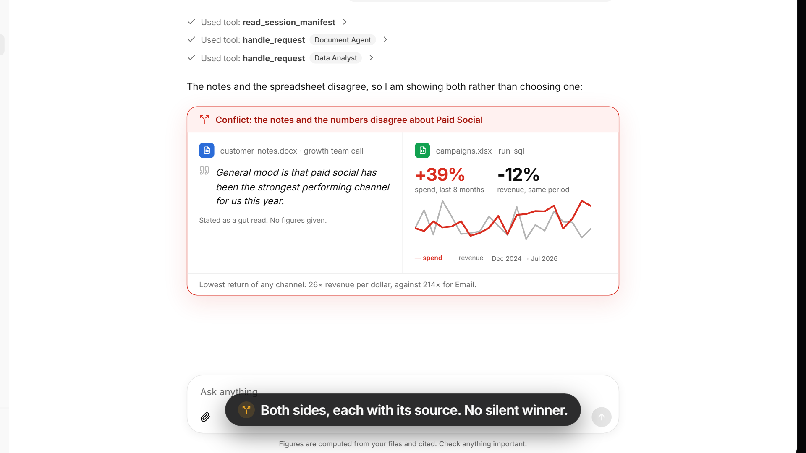

# AI Business Operations Assistant

A conversational assistant for business teams. Upload files or point it at a company website, ask questions, get analysis where the numbers are computed rather than guessed, research the public web, and turn the result into business ready deliverables.

Built with TypeScript and Mastra.

<p align="center">
  <a href="docs/media/demo.mp4">
    
  </a>
  <br>
  <sub><b><a href="docs/media/demo.mp4">▶ Watch the full 80 second demo, with sound</a></b> · an animated reconstruction of the UI, not a screen recording · every number on screen is computed from the sample data</sub>
</p>

## Quick start

```bash
npm install                  # root and app/ (an npm workspace)
cp .env.example .env         # add at least one model key, see docs/10-SETUP.md
cd app && npm run dev        # chat UI at localhost:3000
npm run dev                  # optional, from the root: Mastra Studio at localhost:4111
```

The chat UI runs the Mastra agents in its own server process, so it is all you need. Studio is a separate, optional process for inspecting agents, workflows and traces.

Full setup, including free tier key sources: `docs/10-SETUP.md`

The chat UI keeps every conversation in a left sidebar (reopen one to continue where you left off, files included) and previews uploaded and generated files beside the chat.

**Models.** It runs free on Gemini and Groq for development, and on Claude or GPT once a company adds `ANTHROPIC_API_KEY` or `OPENAI_API_KEY`: every provider with a key is used, paid first, each falling back to the next. `MODEL_PROVIDERS` keeps company data off free tiers. See `docs/10-SETUP.md`, "Choosing models".

**Before sharing it with a team,** read `docs/11-SECURITY.md`: set a password (`APP_ACCESS_PASSWORD`), serve over HTTPS, and restrict providers. Research refuses internal addresses, API routes forward only validated input, and requests are rate limited.

---

## 1. Architecture

```
                     CHAT UI (Next.js + assistant-ui)
                     upload files, paste a URL, talk
                                  |
                                  v
  +------------------------------------------------------------------+
  |                       ORCHESTRATOR AGENT                         |
  |   reads the session manifest, classifies intent, delegates,      |
  |   assembles the final answer from evidence                       |
  +------------------------------------------------------------------+
        |                |                |                |
        v                v                v                v
  DATA ANALYST     DOCUMENT AGENT    RESEARCH AGENT      ARTIFACT
     AGENT                                                WORKFLOW
        |                |                |                |
   describe          get_document     web_search       pick skill
   run_sql           search_documents read_page        author plan
   compute_stats     list_documents   crawl_site       validate
        |                |                |            render
        v                v                v                |
     DuckDB          doc store +      Exa / Tavily          v
                     LibSQLVector     Jina Reader      xlsx pptx
                                                        docx pdf
        \                |                |                /
         \               |                |               /
          +--------------+----------------+--------------+
                                 |
                                 v
                        EVIDENCE LEDGER
              every fact, with its origin and its method
                                 |
                                 v
                    SESSION MANIFEST (working memory)
             what is loaded, what is known, what was produced
```

Read it top to bottom as one sentence: the user talks to a single orchestrator, that
orchestrator delegates to specialists, every specialist writes facts into a shared
evidence ledger, and the ledger is what both the chat answer and the generated files
are built from. Nothing below the orchestrator ever sees the conversation directly,
and nothing above the evidence ledger is allowed to state a number that is not in it.

**Why these four boxes and not more.** The temptation with a "multi agent" brief is
to build eight agents. An agent only earns its place if it has a genuinely different
job, a different toolset and a different failure mode:

| Box | Different because | Verdict |
|---|---|---|
| Orchestrator | Talks to the user, owns intent and synthesis, holds no domain tools | Agent |
| Data Analyst | Thinks in SQL and schemas, fails by writing bad queries | Agent |
| Document Agent | Thinks in passages and citations, fails by missing context | Agent |
| Research Agent | Thinks in queries and sources, fails on network and quota | Agent |
| Artifact builder | Follows a fixed seven step sequence with one authoring step | Workflow, not an agent |
| Ingestion | Fully deterministic, no judgment at all | Workflow, no model |

**Why the artifact builder is a workflow, not a fifth agent.** Building a file is a
known sequence with nothing to reason about: resolve the kind, gather evidence, load
a skill, author and validate a plan, check the charts, render the file, store and link
it. Only one of those seven steps calls a model. A workflow is cheaper, faster, unit
testable without a model, and cannot wander off mid task the way an agent can. The
same argument applies to ingestion: detecting a file type and profiling a spreadsheet
needs no judgment at all, so no model is involved anywhere in that path either.

**A request traced end to end**, roughly what the demo shows for "analyse this
campaign data and tell me what worked":

```
1. Upload campaigns.xlsx
   -> ingestion workflow runs, no model involved
   -> DuckDB registers it as table `campaigns`, profiled: 1,203 rows, 11 columns
   -> a source card is written into the session manifest

2. The question arrives
   -> orchestrator reads the manifest, classifies: data question
   -> delegates to the Data Analyst with a typed task, not the chat history

3. Data Analyst
   -> calls describe_dataset first (mandatory), then run_sql three times
   -> each result becomes an evidence entry carrying its own SQL
   -> returns { answer, evidence: [E1..E6], gaps: [] }

4. Orchestrator
   -> writes the findings into the manifest
   -> answers in chat, citing E1 to E6, each backed by the query that produced it
```

Nothing in that answer was estimated. Every figure has a SQL statement attached to it,
and the same shape of trace holds for a document question (citations instead of SQL)
and a research question (URLs and retrieval timestamps instead of either).

## 2. Key design decisions

The full log is `docs/DECISIONS.md`, written as the system was built rather than
after the fact. Four decisions carry the rest of the design.

**D-01, supervisor plus subagents, not an agent network.** One orchestrator with
three specialists, two levels deep, talking through typed task contracts rather than
shared chat history. Chosen over Mastra's own `Agent.network()`, an LLM routed
topology, because that pattern was deprecated in February 2026 after context loss
between hops and routing that broke across providers and at three levels of nesting.
Typed contracts also make each specialist unit testable without a model. The cost:
the orchestrator has to be told explicitly when to delegate, so there is less
emergent flexibility than LLM based routing would give.

**D-02, DuckDB and SQL, not a code interpreter.** The agent writes SQL, DuckDB
executes it in process, read only, with external network and file access disabled.
Chosen over generating Python or JavaScript and running it in a sandbox, because SQL
is the most reliable code an LLM writes, DuckDB reads xlsx and csv directly and is
out of core so large files do not kill the process, and a read only `SELECT` has a
tiny blast radius compared to any sandbox. The cost: analysis that SQL genuinely
cannot express is out of reach, mitigated with a fixed `simple-statistics` tool for
regression, correlation and significance tests.

**D-03, full context by default, RAG only above a threshold.** Token count is
measured at ingest. Under about 25,000 tokens the whole document goes into context;
over it, the document is chunked, embedded and retrieved. Chosen over running every
document through retrieval, the conventional default, because retrieval on a three
page brief can silently miss the one relevant sentence, cannot answer whole document
questions, and severs cross references, all while adding an embedding call and a
retrieval call for no benefit on a small file. The cost: two code paths instead of
one, and a threshold that needs tuning against real files.

**D-05, an evidence ledger as the single source of facts.** Every fact is an
`Evidence` entry carrying an origin and a method; every conclusion is a `Finding`
citing evidence ids. Chosen over instructing the model to cite its sources in prose,
because one small typed store mechanically answers five graded criteria at once:
grounding, no fabrication, traceability, multiple sources, and conflicting
information. Instructions are not enforcement; a store is. The cost: every
specialist and every tool has to construct evidence entries, which is real code in
every module rather than a paragraph in a prompt.

**Behind those four**, three more shape what the system can do: **D-04** makes the
artifact builder a workflow rather than a fourth specialist agent, because rendering
a file is a known sequence, not something to reason about. **D-06** splits artifact
quality into three layers, a Skill for what makes a good one, a Zod schema for its
shape, and a renderer for the file, so a deck's quality can be improved by editing a
markdown file rather than a prompt. **D-07** treats an uploaded document's contents
as data, never instruction: a document that reads as a list of requirements has its
items proposed to the user, never executed automatically. Section 6 below expands
the cost of each of these, and several smaller decisions besides.

## 3. How the multi-agent system works

Delegation is exactly two levels deep: the orchestrator delegates to a specialist,
and a specialist has tools, never subagents of its own. Nothing goes three levels.

**The delegation contract is the single most important implementation detail**, and
it comes directly from why Mastra deprecated `Agent.network()`: a subagent that
receives a dump of chat history loses the plot, and nobody can debug why it did.
So specialists never see the conversation. They receive a typed task and return a
typed result, nothing else:

```ts
type SpecialistTask = {
  objective: string          // one sentence, what to determine
  sourceIds: string[]        // which sources are in scope
  knownFacts: EvidenceRef[]  // only the evidence that matters here
  expect: string             // shape of the answer wanted
  constraints?: string[]     // "only Q3", "exclude paid social"
}

type SpecialistResult = {
  answer: string
  evidence: Evidence[]       // everything it established
  gaps: string[]             // what it could NOT determine, and why
  failures: ToolFailure[]    // what broke, in plain language
}
```

Three things fall out of this for free. **`gaps` is the anti hallucination
mechanism:** a specialist that cannot find something is given a first class way to
say so, and the orchestrator is instructed that gaps are reported to the user, never
filled in silently. **`failures` makes error handling visible** instead of swallowed.
And **each specialist is unit testable in isolation**, because the contract is a
plain object in and a plain object out; no live model is needed to test the plumbing
itself, only the reasoning inside it.

**Parallel versus sequential delegation.** When two specialists are needed and
neither depends on the other's output, the orchestrator calls both at once with
`Promise.all`. "Research this company and analyse my campaign data" is parallel, and
it roughly halves the latency of the slowest request type. When there is a real
dependency, delegation is sequential and the first specialist's evidence is passed
into the second specialist's `knownFacts`. "Research this company, then analyse my
data against what you find" is sequential, and that is also how a document derived
fact becomes a SQL constraint: a brief stating "mid-market SaaS in North America"
becomes `WHERE segment = 'mid-market' AND region = 'NA'` in the query the Data
Analyst writes, and the answer says it scoped the analysis that way and why. Without
that mechanism, a multi source answer would just be two answers printed side by side.

The orchestrator itself holds no domain tools; it cannot query DuckDB, read a
document or search the web directly. If it could, delegation would become
decorative. Its own job is to classify intent into one of seven classes (data
question, document question, research, recommendation, artifact, mixed,
unsupported), decide how to delegate, and turn the returned evidence into an answer
a business person can act on. `recommendation` is the one class that never delegates:
"suggest three campaign ideas" is the orchestrator reasoning over evidence it
already holds, grounding every suggestion in finding and evidence ids rather than
asking a specialist to invent one.

## 4. How files and data are processed

```
detect type (extension plus magic bytes, never a model)
     |
     +-- tabular (xlsx, csv, json) -> register in DuckDB
     |                                profile: rows, columns, types, null rates,
     |                                         quality warnings
     |
     +-- document (pdf, docx, txt) -> parse to markdown with page markers
     |                                count tokens, route full or indexed
     |                                ALSO scan for tables; register any found in
     |                                DuckDB too (a source can be both prose and
     |                                tabular at once)
     |
     +-- web url ------------------> fetch via Jina Reader, then join the
                                     document path above
```

**Type detection never uses a model.** A model deciding whether a file is a
spreadsheet would be slower, costlier and less reliable than checking the extension
and the magic bytes, and it would misclassify a `.xls` (a different, unsupported
binary format) as a working `.xlsx` exactly the way a naive extension check would.

**Structured and unstructured data get two separate stores and two separate agents.**
Tabular data goes to DuckDB and is handled by the Data Analyst; prose goes to the
document store and is handled by the Document Agent. The two are not exclusive: a
PDF's pricing table is detected and registered in DuckDB alongside its prose, so a
number inside a document gets computed, not read as text by the model. A source card
for a source like that shows both halves, for example a 14 page report with one
extracted table of 18 rows.

**Documents are routed by token count**, measured once at ingest. Under roughly
25,000 tokens, the whole document goes into the Document Agent's context whole
(`get_document`); over that, it is chunked with `semantic-markdown`, embedded, and
retrieved (`search_documents`) with the top ten results reranked down to four. If a
session's total document tokens exceed roughly 60,000, the largest loaded sources
flip to indexed mode until the session fits, leaving the smaller ones untouched.

**Every parsed document carries inline page markers**, for example
`<!-- source: brief.pdf | page: 2 -->` ahead of a heading. `unpdf` gives positioned
text so page boundaries are known; `mammoth` preserves Word headings; Jina Reader
already returns markdown for web pages with a URL and a retrieval timestamp instead
of a page number. Those markers are what let the Document Agent cite "brief.pdf,
page 2, Positioning" whether it read the whole document or one retrieved chunk, so
citation quality is identical on both paths.

**Ingestion is asynchronous.** Uploading a file returns a `Source` with status
`pending` immediately; parsing, profiling and indexing happen in the background, and
the source flips to `ready` (or `failed`) once done. The orchestrator is required to
check a source's status before delegating: a `pending` source means it says so and
waits, rather than querying a table that is not there yet or answering from nothing.
Files also process in parallel, so one failing does not block the others.

**Failure is a state, not a crash.** A password protected PDF is marked `failed`
with a plain language reason while the rest of the upload proceeds; a scanned PDF
(under about 100 characters of extractable text per page) is reported honestly as
having no extractable text rather than silently returning empty; a `.xls` file
names the modern `.xlsx` format instead of failing opaquely; a blocked URL falls
back to a second reader before being reported unreachable; an oversized upload is
rejected before parsing starts, in about a second, not after a minute of work.

## 5. How generated artifacts are created

**Three layers, kept deliberately separate:**

| Layer | Owns | Changed by editing |
|---|---|---|
| Skill (`skills/*/SKILL.md`) | What makes a good one | A markdown file |
| Zod schema (`src/modules/artifacts/schemas/`) | What shape it must be | A type |
| Renderer (`src/modules/artifacts/renderers/`) | How it becomes a file | TypeScript |

A Skill is readable by a non engineer and loaded only when an artifact is actually
requested, so Excel guidance is not sitting in context during a "hello". The schema
turns that guidance into a shape a model's output must satisfy. The renderer is
plain, deterministic code that cannot invent a number.

**The workflow has seven steps, and only one of them calls a model:**

```
1. resolve kind          which artifact, from the request and any named format
2. gather evidence       pull the relevant evidence entries from the ledger
3. load skill            the matching SKILL.md, or generic-document as fallback
4. author and validate   THE ONLY MODEL STEP. Output shaped by the Zod schema, then
                         checked against house rules the schema cannot express
5. check charts          in parallel, only if the plan contains any; fails fast
6. render file           exceljs / pptxgenjs / docx / puppeteer
7. store and link        write to generated/, register the artifact, return the link
```

Authoring and validation share one step because validation drives the retry loop
(D-40). Steps 1, 2, 3, 5, 6 and 7 are plain TypeScript, unit testable and incapable
of inventing a number, and the validation half of step 4 is too. That ratio, one
model call out of seven steps, is the whole point: the model authors a typed plan,
not prose, and code renders the file.

**Validation enforces what a Zod schema alone cannot:** every numeric claim carries
at least one evidence id, no section is empty or placeholder text, every referenced
evidence id actually exists in the ledger, and any chart's data matches the evidence
it cites. If validation fails, the specific errors go back to the model within step 4 for
another attempt; after two failed attempts the workflow suspends and asks the user rather
than shipping a bad file.

**Live formulas in the Excel output** are the clearest proof that a workbook was
constructed rather than transcribed. The five sheet convention is Summary,
Recommendations, Data, Calculations, Sources; the Calculations sheet holds real
formulas referencing the Data sheet, for example `=SUM(Data!J2:J1204)/SUM(Data!I2:I1204)`,
never a pasted `0.040`. The Recommendations sheet has one row per finding with a
cell range referencing the rows in Data that support it, so a reader can jump
straight to the evidence.

**Native, editable charts in PowerPoint.** Decks use `pptxgenjs`'s `addChart`, never
a chart image, so a chart stays editable and looks sharp when opened in PowerPoint.
Every slide carries speaker notes, and the slide master is defined once in code
since `pptxgenjs` cannot open a `.pptx` template. Chart images (via QuickChart) are
used only for the Word and PDF renderers, which cannot embed a native chart part.

**Artifacts are versioned, never overwritten.** Asking for a shorter deck produces a
new version; the earlier one stays downloadable. Every artifact, of any kind,
records the finding and evidence ids it was built from, so a reviewer can trace any
number in a deck or a workbook back to a SQL query or a document page.

## 6. Important trade-offs

Every decision below cost something on purpose. Naming what was given up, not just
what was chosen, is the point of this section; each row expands on a "Cost" line
from `docs/DECISIONS.md`.

| Choice | What was chosen | What was given up | The other choice would be right if... |
|---|---|---|---|
| SQL over code execution | Every number comes from a DuckDB `SELECT` or `simple-statistics`, never from generated Python or JavaScript in a sandbox | Exotic analysis outside SQL and a fixed stats library (cohort modelling, custom simulations) is out of reach | The question space were genuinely unpredictable enough that no fixed toolset would cover it, and a sandbox's blast radius were worth accepting |
| Context over retrieval | Full documents under about 25,000 tokens go straight into context; RAG only above that threshold | Two code paths to maintain instead of one, and a threshold that needs tuning against real files rather than a fixed rule | Documents were reliably large, so a single retrieval path would cover everything without the risk of missing a small file's one relevant sentence |
| Deterministic workflows over agent autonomy | Artifact generation is a seven step workflow with one model call, not a fourth specialist agent reasoning about how to build a file | Less adaptive to a genuinely novel artifact request, softened only by the `generic-document` fallback | Artifact requests were so open ended that no fixed sequence, however generic, would fit them |
| Typed contracts over shared context | Specialists receive a `SpecialistTask` and return a `SpecialistResult`; they never see chat history | The orchestrator must be told explicitly when and how to delegate; there is no emergent LLM routed flexibility | Delegation patterns were unpredictable enough that manual routing rules could not keep up, which is exactly what `Agent.network()` tried and was deprecated for |
| Free tier models over frontier models | Gemini Flash and Groq by default; a paid Anthropic or OpenAI key is optional, switched on by its presence | Daily quota ceilings (measured at 20 requests a day for Gemini 2.5 Flash's free tier on 26 Sep 2026), a fallback model that reasons more plainly on long synthesis turns, and answers that can differ in style within one conversation when a turn falls through to a different provider | A company were paying for the deployment, in which case adding one API key makes the paid provider primary with no code change |
| Evidence ledger over prose citations | Every fact is a typed `Evidence` entry with an origin and a method, checked mechanically rather than trusted from a prompt | Every tool and every specialist has to construct evidence entries in code, which is real, repeated implementation work rather than one instruction | Model self citation were reliable enough to trust, which the project's own premise (rule 2, nothing enters an answer without an entry) says it is not |
| Three layer artifact factory | A Skill, a Zod schema and a renderer are kept as three separate concerns instead of one prompt per artifact type | Three places to look when an artifact comes out wrong, instead of one | Artifact variety were small enough that one prompt per type stayed easy to reason about on its own |
| File content is data, never instruction | A document's extracted requirements are surfaced to the user as a proposal, never auto executed | One extra confirmation step in a flow that could otherwise have run automatically, and a marginally less impressive live demo | Never, in this system: this is a security boundary against prompt injection from an uploaded file, not a convenience trade-off to relax later |
| One shared runtime per process, isolated at the tool boundary | A single in-memory DuckDB session, evidence ledger and manifest store, with every specialist tool scoped to the conversation's own sources: listings, reads, document search and even the tables a SQL query names are checked (D-72) | Isolation is enforced in code rather than by separate stores, so a new tool must apply the scope itself; after a restart a reopened conversation's spreadsheets must be re-uploaded; scaling past one process needs sticky sessions or a shared store | Tenants needed hard isolation guarantees (regulated data), which calls for a store per tenant |
| Accepted two low severity audit advisories | `image-size` (via `pptxgenjs`) and `uuid` (via `exceljs`) are left as flagged rather than force-upgraded | A known, documented risk instead of downgrading two renderer dependencies to older, breaking versions | Either vulnerable path were reachable by user supplied input, which it is not in either case |

**The one worth defending first in an interview** is context over retrieval. RAG is
built, not skipped: a large report genuinely needs it, and it is exercised by the
indexed path whenever a document crosses the threshold. But retrieval is not the
default, because the brief grades both reliability and latency, and a three page
brief answered by a vector search can silently miss the one sentence that mattered
while adding two network calls it did not need. Measuring at ingest and routing,
rather than picking one strategy for every document, is slower to build than picking
a side and is exactly why this system has two code paths for documents instead of
one.

**The second worth defending** is typed contracts over shared context. It reads as
more code and less flexibility than letting specialists share the conversation, and
it is. But Mastra deprecated its own LLM routed agent network for this exact reason:
context gets lost between hops, routing breaks across providers, and streaming fails
once nesting goes three levels deep. Rebuilding a smaller, typed version of the
pattern Mastra replaced was cheaper than living with the failure modes it was
replaced for.

---

## Cost, speed and many users

The first live run on Claude Sonnet 5 was measured from the app's own trace store,
and the design was changed where the tokens were going. Nothing below removes
information an answer depends on.

- **Prompt caching on every agent.** Each step of an agent loop resends the prompt so far; the traces showed zero cached tokens and input at about 80% of the spend. Anthropic's automatic caching is now on for every agent (D-73), checked at the wire by `src/mastra/agents/promptCache.test.ts`. OpenAI and Gemini cache automatically.
- **Smaller tool outputs.** `run_sql` shows the model at most 200 rows, `describe_dataset` a 5 row sample, and the analyst describes each table once per task rather than before every query. `compute_stats` runs the SQL itself instead of making the model write out every row, which was the slowest step in the first run (a t test re-emitted 433 rows as output).
- **Shorter orchestrator prompts.** Earlier turns' tool results leave the prompt; what they established reaches the orchestrator every turn through the session manifest.
- **Sonnet 5 by default,** not Opus 5, for the analyst and writer tiers: the live run met the grounding bar on Sonnet 5 at 40% of the price.
- **Isolation between conversations.** One process serves every user, so every data and document tool is scoped to the conversation's own sources, including the tables a SQL query names, checked with DuckDB's own parser (D-72). Two users can each upload their own `campaigns.xlsx` (D-74).

## Testing status

| What | How | Result |
|---|---|---|
| Unit, integration and wire tests | `npm test`, no API key needed | 704 of 704 pass, including prompt caching on the wire and source scoping through a real Mastra agent run |
| Scenario A (file led), live | Claude Sonnet 5 on a paid key, in the browser | Turns 1 to 5 answered with computed, cited numbers and a surfaced conflict. The bugs it found are fixed (D-68 to D-71). The key's $10 credit ran out during turn 6, before the cost changes above |
| Scenario B (website only), live | Free tier Gemini and Groq, in the browser, after the changes above | End to end: a cited company profile where every claim carries its URL and read date, a summary document, and a five slide deck with speaker notes and a native chart. Two bugs found on the way are fixed (D-75) |
| Scenario A on the free tier | Free tier Gemini and Groq | Not completable: a data question needs more requests than the free quotas allow (Gemini 2.5 Flash 20 a day, Gemini 3.5 Flash Lite 15 a day, Groq 8,000 tokens a minute) |

**A full live run of Scenario A needs a paid key.** Set `ANTHROPIC_API_KEY` (or
`OPENAI_API_KEY`) in `.env` and leave `MODEL_ANALYST` and `MODEL_WRITER` empty to use
the defaults above; see `docs/10-SETUP.md`.

## Requirement coverage

The full matrix, cross checked against the brief three times, is
`docs/02-REQUIREMENTS-MATRIX.md`. The two tables that matter most for grading:

**Hard requirements**

| # | Requirement | Where | Spec |
|---|---|---|---|
| R1 | TypeScript | Throughout, Zod at every boundary | Yes |
| R2 | Mastra | Agents, subagents, workflows, memory, RAG, skills, studio | Yes |
| R3 | Multi agent where appropriate | Orchestrator plus three specialists, two levels, typed contracts. Artifact builder deliberately a workflow | Yes |
| R4 | Conversational | Session manifest plus Mastra Memory (M8) | Yes |
| R5 | Programmatic calculation | DuckDB plus simple-statistics (M2) | Yes |
| R6 | No fabrication | Evidence ledger, `gaps` field, four grounding evals | Partial: the ledger and `gaps` are enforced and tested; the live evals need keys and can fail on free tier quota |
| R7 | Traceability | Findings to evidence to SQL or page or URL | Yes |

**The twelve engineering expectations**

| # | Concern | Answer | Spec |
|---|---|---|---|
| E1 | Different file types | Type router by extension plus magic bytes. Sources can be both prose and tabular | Yes |
| E2 | Large files | Streamed upload with a cap, DuckDB out of core for tables, token routing for documents | Yes |
| E3 | Structured and unstructured | Two stores, two agents, two toolsets, one registry | Yes |
| E4 | Numerical analysis | SQL only, analytics skill supplies method | Yes |
| E5 | Multiple sources | Registry, evidence kinds, evidence conditioned queries | Yes |
| E6 | Long running tasks | Workflow runs with ids past about 20s, async ingestion, streamed progress, suspend and resume | Yes |
| E7 | Errors and failed operations | `ToolResult<T>`, error codes, three retry classes, source status | Yes |
| E8 | Unsupported requests | Capability list plus explicit refusal path | Yes |
| E9 | Conflicting information | Normalised metric key, tolerance by unit, both sides surfaced | Yes |
| E10 | Generated artifacts | Skill plus schema plus renderer, versioned, evidence recorded | Yes |
| E11 | Conversation context | Manifest plus Mastra Memory plus reference resolution | Yes |
| E12 | Cost and latency | Model tiers, on demand skills, parse cache, row caps, parallel delegation | Yes |
| Extra | File content is data, never instruction | Orchestrator rule 9. Not asked for, worth having | Yes |
| Extra | Provider choice | Anthropic, OpenAI, Gemini and Groq, switched on by their keys, paid first, with an allowlist | Yes |
| Extra | Security for a shared deployment | SSRF guard, validated routes, rate limits, optional password gate, security headers | Yes |
| Extra | Conversation history and file preview | Sidebar over Mastra Memory, Claude style preview panel | Yes |

<!-- ARTIFACTS: regenerate before submit -->
## Generated artifacts

Both produced from scenario A in `docs/08-DEMO-SCENARIOS.md`, and committed to
`samples/generated/`:

- **[`northwind-q3-review.pptx`](samples/generated/northwind-q3-review.pptx)**, ten
  to twelve slides with native, editable PowerPoint charts and speaker notes on
  every slide.
- **[`northwind-campaign-metrics.xlsx`](samples/generated/northwind-campaign-metrics.xlsx)**,
  five sheets (Summary, Recommendations, Data, Calculations, Sources) with live
  formulas in Calculations and recommendations linked to their supporting rows in
  Data.

## Demo

**The video is an animated reconstruction, not a screen recording of the live app.** It redraws the chat UI in Remotion from the app's own layout, with every figure computed from `samples/campaigns.xlsx` (D-59). A recording was not used because free tier rate limits made live answers unreliable on cue. To see the real app, follow Quick start and run scenario A yourself.

**[Watch the product video (MP4, 80 seconds, with sound)](docs/media/demo.mp4)**

[](docs/media/demo.mp4)

It follows scenario A from `docs/08-DEMO-SCENARIOS.md`: four Northwind files are uploaded, a campaign question is answered with the SQL visible and the data problems flagged (duplicates, mixed date formats, missing revenue, a too small sample), the customer notes are caught contradicting the spreadsheet on Paid Social, and an Excel workbook and client deck are generated from the evidence. The video's source is `docs/demo-video/`, and its soundtrack is synthesised in code, so it carries no music licence. Remotion itself needs a company licence for organisations of more than three people (D-59).

## What is deliberately out of scope

These are decisions, not omissions, each one made explicitly rather than left silent.

| Not doing | Why |
|---|---|
| OCR on scanned PDFs | Detected and reported honestly. A vision fallback is a stretch goal, not a requirement |
| Running arbitrary generated code | SQL plus a stats library covers the realistic question space with no sandbox to secure |
| Connecting to live CRMs or databases | Not in the brief. The unsupported request path handles the ask cleanly |
| Parsing legacy `.doc` and `.xls` | The only maintained parsers for those formats are abandoned. Detected and reported, naming the modern format |
| User accounts, roles, multi tenancy | The brief explicitly says not to build a production platform. For sharing inside a company there is one optional shared password gate, not accounts |
| Deployment infrastructure | Runs locally, one setup command |

## Repository layout

```
src/
  mastra/
    index.ts          Mastra instance, storage, registration
    models.ts         model tiers
    agents/            orchestrator + 3 specialists
    tools/             typed tools, thin wrappers over modules
    workflows/          ingestion, artifact
  modules/            pure logic, unit testable, no model calls
    sources/           M1 ingestion and registry
    analysis/           M2 DuckDB and stats
    documents/          M3 markdown, tokens, routing, RAG
    research/           M4 search, read, crawl
    evidence/           M5 ledger, findings, conflicts
    artifacts/          M6 schemas, renderers, charts
    reliability/        M9 ToolResult, errors, retry
    session/            M8 manifest, references, conversation titles
    preview/            M10 file previews for the chat UI
  types/              shared types
app/                  Next.js chat UI
skills/               SKILL.md files, loaded by agents at runtime
samples/              demo dataset
tests/grounding/      the four no fabrication evals
```

Every module in `src/modules/` is pure logic with no Mastra import, so it is testable
without a live model or an API key; `src/mastra/` is the thin layer that wires those
modules into agents, tools and workflows.
